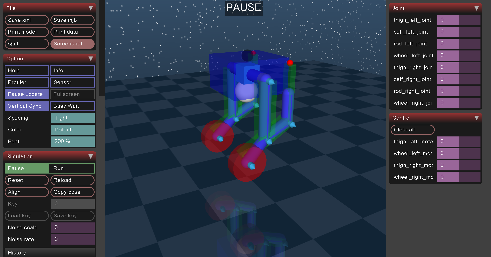
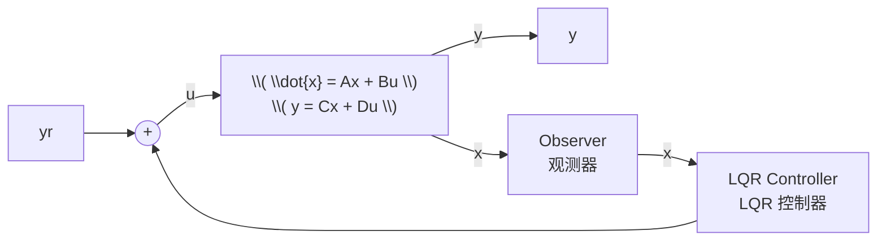

### 安装基本都环境
```
conda env create -f environment.yaml
```
### 
运行脚本

```
python3 lqr_lw.py
```


```mermaid
flowchart LR
    yr[yr] --> sum((+))
    sum --> |u| system["\\( \\dot{x} = Ax + Bu \\) <br> \\( y = Cx + Du \\)"]
    system --> |y| output[y]
    system --> |x| observer["Observer <br> 观测器"]
    observer --> |x| lqr["LQR Controller <br> LQR 控制器"]
    lqr --> sum

```